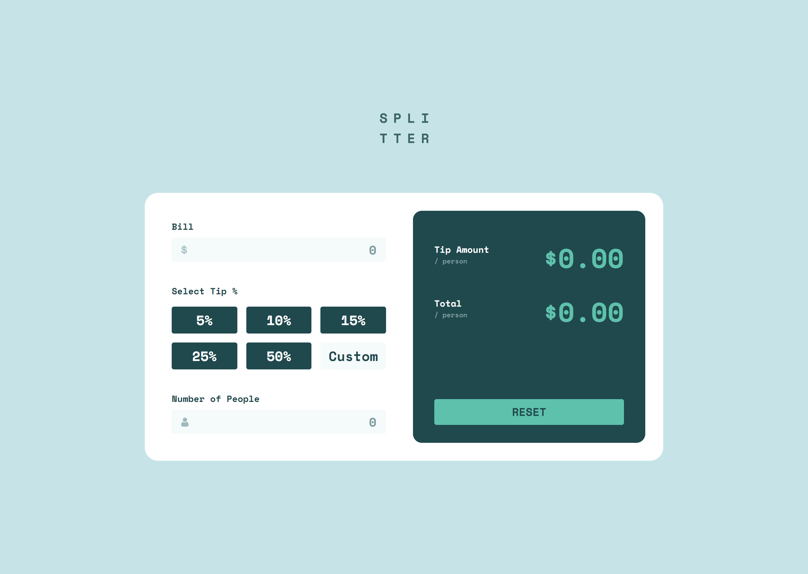

# Tip calculator app

This is a solution to the [Tip calculator app challenge on Frontend Mentor](https://www.frontendmentor.io/challenges/tip-calculator-app-ugJNGbJUX). Frontend Mentor challenges help you improve your coding skills by building realistic projects.

## Overview

### The challenge

Users should be able to:

- View the optimal layout for the app depending on their device's screen size
- See hover states for all interactive elements on the page
- Calculate the correct tip and total cost of the bill per person

### Links

- **Links will be added soon**

## My process

### Built with

- Semantic HTML5 markup
- Sass
- Flexbox
- CSS Grid
- Mobile-first workflow
- **(JS will be added in the future)**

## Author

- Github - [hesam-fattahi](https://github.com/hesam-fattahi)
- Frontend Mentor - [@hesamf01](https://www.frontendmentor.io/profile/hesamf01)
